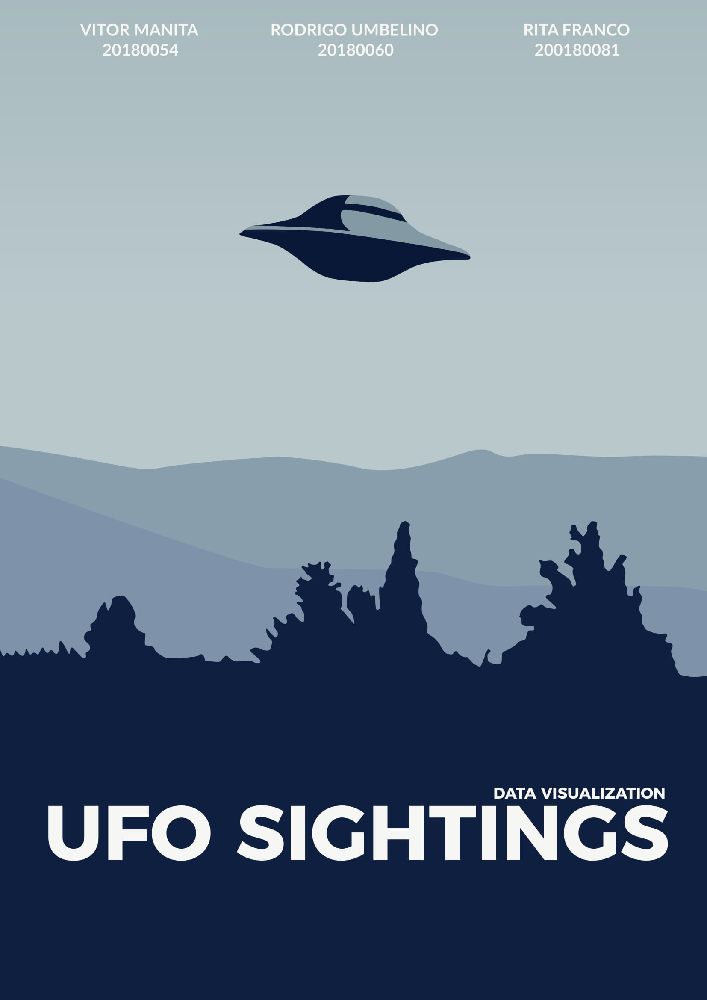
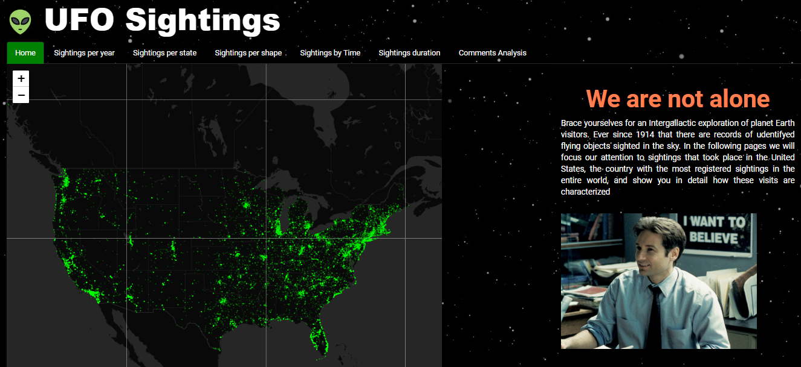
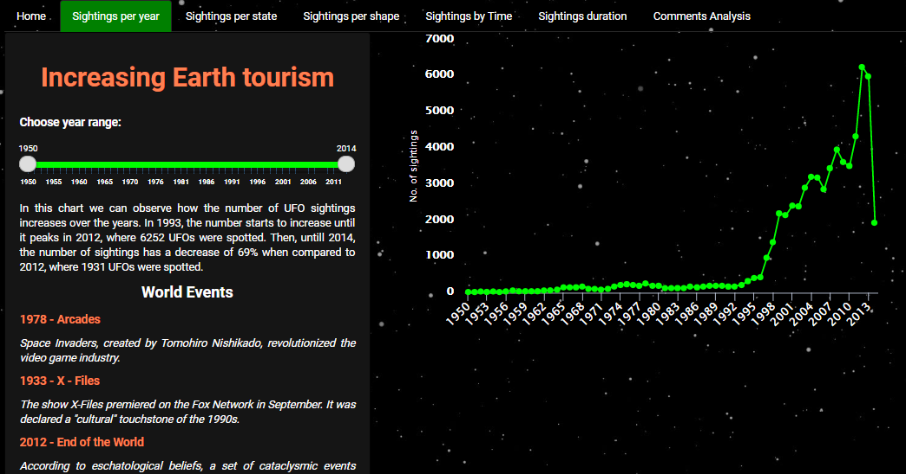
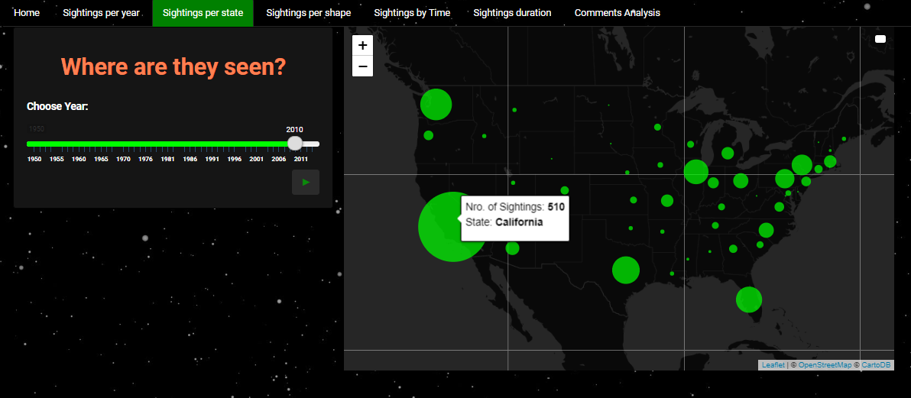
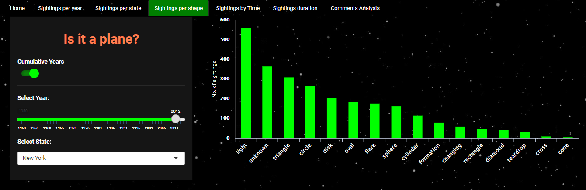
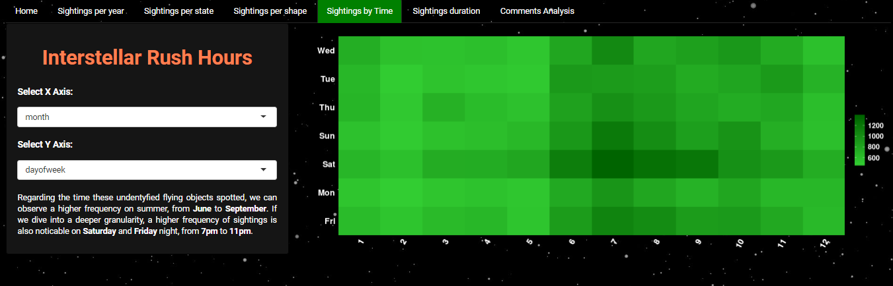
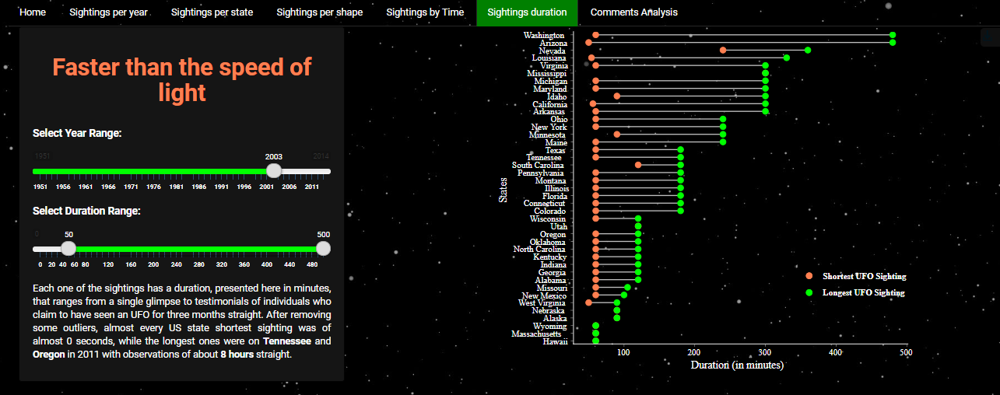
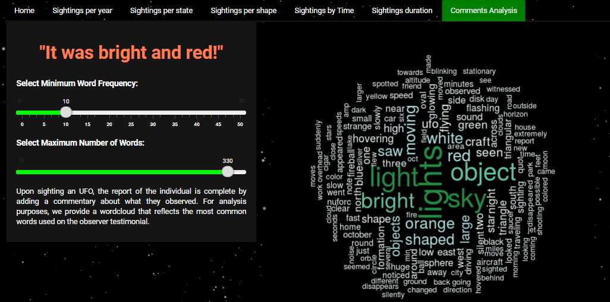

# UFO-Sightings-Data-Visualization

Data collected from a Kaggle dataset entitled *UFO Sightings*. This dataset was divided into two versions, complete and scrubbed. The main difference between the two is that the scrubbed version did not have any missing/incomplete reports. For the latter reason, and for the sake of simplicity, the scrubbed version of the data set was used, which even though it is smaller than the complete data set, it still covers a total of around 80 000 records. For the visualization component,the records were narrowed using only sightings from 1994 onwards and only recorded in the United States. The project was accomplished using R programming language and the Shinny Apps api platform for the visualization.

You can explore the visualizations yourself here: https://manita.shinyapps.io/UFO_WEB/

## 1. Dataset Description
For this Data Visualization project, we researched multiple datasets from different sources.
We wanted to choose an interesting topic, which would also allow us to create some
challenging visualizations, and apply the concepts that we learned in the practical classes of
the course during the semester.
Having this in mind, we eventually stumbled upon a Kaggle dataset entitled “UFO Sightings”
[1]. This dataset was divided into two versions, complete and scrubbed. The main difference
between the two is that the scrubbed version did not have any missing/incomplete reports.
For the latter reason, and for the sake of simplicity, we decided to go forward with the
scrubbed version of the data set, which even though it is smaller than the complete data
set, it still covers a total of around 80 thousand records. For the visualization, we narrowed
the records a bit using only sightings from 1994 onwards and only recorded in the US.
Analyzing the data set in more detail, it is composed of 11 different variables, and every
single one of them is described in table 1.

## 2. The inspiration for the project
The inspiration for this project came from different places. Regarding the theme of the
project, and the dataset itself, all members of the group are big fans of Sci-Fi and popculture.
So, when we came across a Kaggle dataset [1] with information about UFO
Sightings, it was the perfect fit. When it comes to the visualizations, we researched
published public works online [3], to get a sense of the kind of visualizations that we wanted
to produce, and the aesthetics that we wanted to convey.

## 3. The Visualization
The produced visualization follow an Interactive slideshow structure, balancing the authordriven and reader-driven stories, where it freely allows the user to explore the data mid-narrative, at his own pace, before moving on to the next chapter of the narrative. The
layout is simple, organized and thematic. Overall, there are seven tabset panels and, as the user navigates through them, the granularity/level of information detail increases.
The visualization starts with a generic panel
Home, that introduces the theme to the
user, providing the data scope and source of
the information. The objective of this tab is
to introduce the narrative. In this same page,
a US map is available, pinpointing the
locations of UFO sightings since 2010, to
provide a general idea.

Next, at Sightings per Year, users can explore
the evolution of total
sightings per year in the US by analyzing a
line plot, where we use points as marks and
brings an interactive feature, giving the user
the ability to choose the year range and to explore the number of sightings in more detail.
Given the big discrepancies between years previous and after 1993, it is useful
to analyze different time ranges and realize that prior to 1993, the evolution line in a global
range becomes indistinguishable. Furthermore, in this panel, some
information regarding events that might be correlated with the increase of
sightings are provided to the users in a sidebar panel.

The following tab shows the recorded sights of UFO through a leaflet map with circle
markers whose radius varies according to the number of sightings. This information is
presented to the user by an animation that will automatically start in the year 1990 and
move until the end of the period. The main objective of this tab is to present the user with
more geographical information of where the sights occur. After the animation is played, the
user is free to decide which year to see and by hovering the mouse cursor above the
markers’ information, it is displayed containing the number of UFO that have been seen and
the name of the state.

Moving forward in the visualization, we have information regarding the shape of the seen
UFO. In Sightings per Shape, the user accesses information through a bar plot that shows
the number of UFO by the 18 shape categories. In this tab there are also interactive
features, the user can choose if the data relates to the whole country or only a specific state
in a dropdown widget. Furthermore, there is the option between filtering data of only one
chosen year, or observe the cumulative data from 1950 (beginning of the period) until that
chosen year, created with both a checkbox and a slider widget. Some individuals see triangle
and light like shapes, and others observe a less frequent diamond shaped object. Counting
all frequencies, the most common shapes, excluding the unknown ones, are light, triangle,
circle, flare and disk.

Another important analysis is to see when sightings are mainly occurring during the
day/night, in the beginning, or ending of the week and so on. This analysis is provided to the
user by a heatmap where we see the absolute frequency of spotted UFO by different time
variables. At Sightings per Time, users can interact by choosing the granularity of the axis,
they can choose between observing: day (of the month), the day of the week, month or
hour in each of the axis. Conclusions can be made such as there is higher frequency on
summer, from June to September and also a higher frequency of sightings on Saturday and
Friday nights, from 7 pm to 11 pm, during drinking hours.

Each of the sightings has a duration, presented in minutes, that ranges from a single glimpse
to testimonials of individuals who claim to have seen a UFO for three months straight. In
this tab, Sightings duration, users can explore how durations vary along the year in all the
different states. For the interactivity tab, it was implemented with two sliderInput that
invites the user to choose the years’ range and the duration’s range that he wants to see.

Lastly, using the commentary about what people observed, we presented a completely
different tab where users can analyse the most common words used on the observer
testimonial through a Wordcloud. The majority of the comments have words like light,
bright, object and sky. There are also some shapes and colours in the most frequent words,
namely red, white and orange. To make this more interesting, we created two sliders that
allow the user to control the Wordcloud output. The top slider controls the minimum
frequency with which a word has to appear to be shown in the chart, while the second slider
controls the maximum number of words that appear in the chart.

## 4. Discussion
This project was really important to complement the practical lectures and allowed us to
better understand the R language and deepen our knowledge, especially in controlling the
details of Shiny apps visualizations. In addition to this, it was also really useful to put into
practice all the theoretic principles learnt. We believe that it was really interesting to be
able to choose the data we were working on because it allowed us to explore a more
“informal” theme that we liked and consider interesting.
Throughout the project, we felt some limitations regarding the language and the amount of
time needed to understand how to control all the details, given that it was the first big
project where we used RStudio. Nevertheless, we felt that the basis learned during classes
were really important and used some as baselines.
In the end, we were happy with the result of our visualization and felt that all the time spent
researching about R paid off, given the final Shiny app. Even though we think that the result
turned out good, there are some things that could be improved in the future, such as trying
to implement this in Tableau.

## 5. References
[1] https://www.kaggle.com/NUFORC/ufo-sightings#scrubbed.csv, consulted on 09/01/2019

[2] http://www.sealthreinhold.com/school/tuftes-rules/rule_one.php, consulted on 12/01/2019

[3] https://public.tableau.com/profile/zach.bowders?fbclid=IwAR28keHKFXNGuaTElrH208tSuuL-
2NY20WWJP5uk3rnvjJbuBQrLsDNPLM#!/vizhome/SaucerCountryExposingAmericasSecret
Post-RoswellUFOSightings/SaucerCountry, consulted on 09/01/2019
